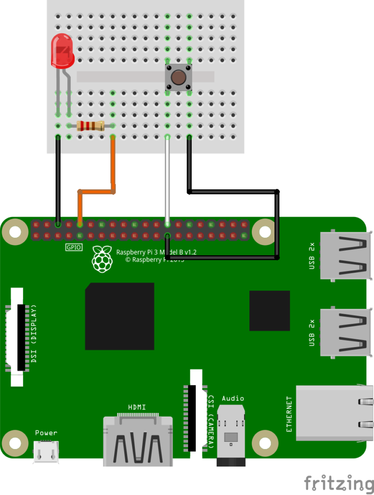

# Tech Community Day 2020 - Demo 04
## Demo de .NET Core - Raspberry Pi
# Diagrama del circuito

# Contenedores

1. Clonar código fuente
2. Entrar al directorio del proyecto
3. Construir el circuito electrónico.
4. Ejecutar el proyecto.
    
    dotnet build
    
    dotnet run

# Enlaces de ayuda

[Instalación de .NET Core en Raspberry Pi](https://elbruno.com/2019/12/30/raspberypi-how-to-install-net-core-3-1-in-a-raspberry-pi-4/)

[Configuración de Proxy Nginx para salida de Raspbery Pi](https://thomaslevesque.com/2018/04/17/hosting-an-asp-net-core-2-application-on-a-raspberry-pi/)

[Artículos de ejemplo](https://www.petecodes.co.uk/explorations-in-dot-net-core-3-0-for-raspberry-pi-part-2/)